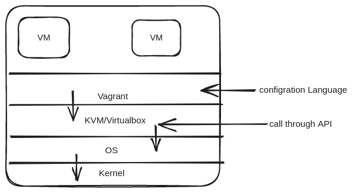

# How to install vagrant using vitualbox at Ubuntu

<figure >

  
  
Dataflow Diagram

</figure>

    sudo apt-get update
## Install Virtualbox
    sudo apt-get -y install virtualbox

- when virtualbox install some problem face like dpkg was interrupted, you must manually run 'sudo dpkg --configure -a' to correct the problem. 

        sudo dpkg --configure -a

        sudo apt-get -y install virtualbox
-   Unmet dependencies. Try 'apt --fix-broken install' with no packages (or specify a solution).

        sudo apt-get -f install

 - reference link : https://askubuntu.com/questions/118749/package-system-is-broken-how-to-fix-it

        sudo apt-get -y install virtualbox

- Then Successfully Install Virtualbox
## Install Vagrant 
    sudo apt-get -y install vagrant

## Check Vagrant Version
    vagrant --version

## Make Directory
    cd Documents/

    mkdir VirtualMachines

    cd VirtualMachines/

    mkdir Ubuntu18

    cd Ubuntu18/

## Ubutu Image Add 
    vagrant box add ubuntu/bionic64

## Initialized Ubutu Image
    vagrant init ubuntu/bionic64

## create and configure the virtual machine as specified in the Vagrantfile
    vagrant up

## Check Vagrant Status
        vagrant status

## ssh into the virtual machine
    vagrant ssh

## Exit virtual machine
	exit
## stop the virtual machine    
    vagrant halt    

## destroy all resources created during the creation of the machine
    vagrant destroy

## Uninstalling Vagrant
    sudo apt-get remove –auto-remove vagrant

